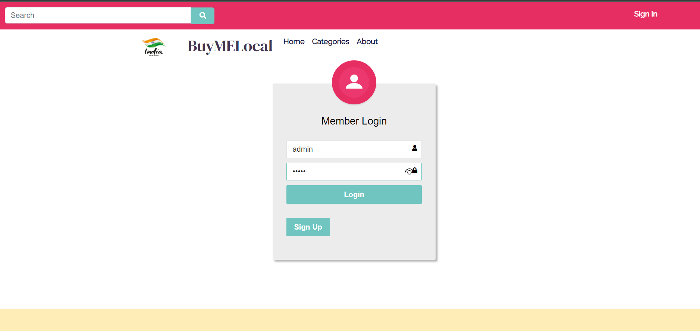
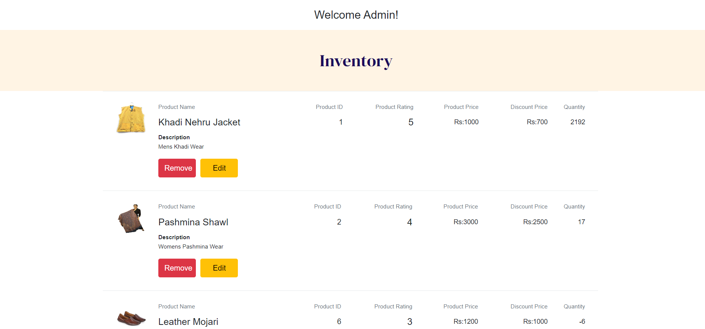
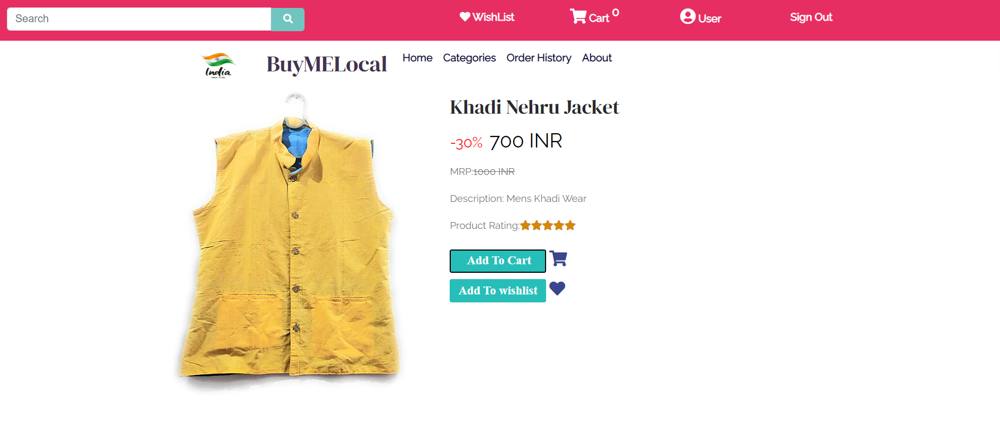

# BuyMeLocal

An educational full-stack marketplace for browsing and purchasing local handloom products.

> This is a learning project, not a production commerce system. Do not use it with real payment, customer, or credential data.

## Features

- Users can register, sign in, browse products, manage a cart and wishlist, place orders, and view order history.
- Administrators can manage products.

## Preview

| Sign in | Admin | Products |
| --- | --- | --- |
|  |  |  |

## Structure

| Directory | Purpose |
| --- | --- |
| `Frontend/` | Angular 14 web application |
| `ProductWebAPI/` | .NET 5 ASP.NET Core API |
| `EcomDB Scripts/` | SQL Server schema and development fixture scripts |

## Run Locally

Prerequisites: Node.js compatible with Angular 14, .NET 5 SDK, and SQL Server.

1. Create the `Ecommerce` database and apply the SQL scripts in `EcomDB Scripts/`. The included users are fictional development fixtures only.
2. Configure the API connection string in `ProductWebAPI/ProductWebAPI/appsettings.json` for your local SQL Server instance.
3. Set a local JWT signing key outside Git before starting the API:

   ```bash
   export Jwt__SigningKey='replace-with-a-long-random-local-value'
   ```

4. Start the API and frontend in separate terminals:

   ```bash
   dotnet run --project ProductWebAPI/ProductWebAPI/ProductWebAPI.csproj
   ```

   ```bash
   cd Frontend
   npm ci
   npm start
   ```

The frontend calls the API at `http://localhost:33037/`. Adjust the frontend service base URLs if your local API runs on another address.

## Development Notes

- .NET 5 is end-of-support, so framework upgrades should be handled as a separate tested task.
- The current authentication and authorization model is prototype-only. Do not deploy it or use real credentials.
- No license has been selected. Do not assume permission to copy, modify, or redistribute this project.

## Contributing

See [CONTRIBUTING.md](CONTRIBUTING.md).
